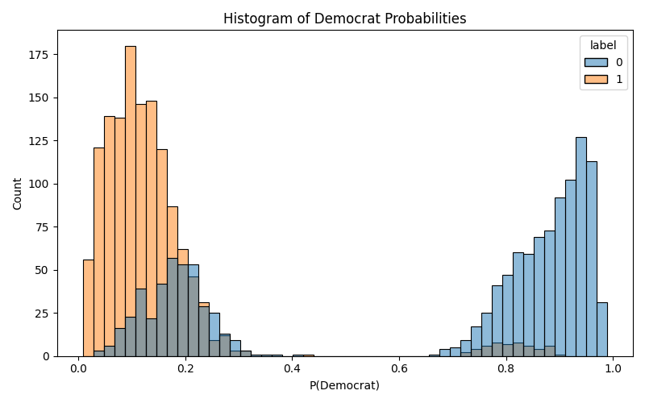
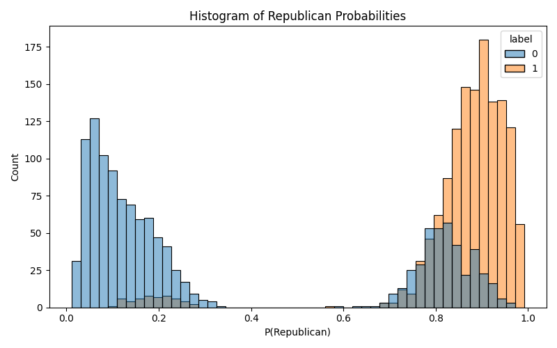
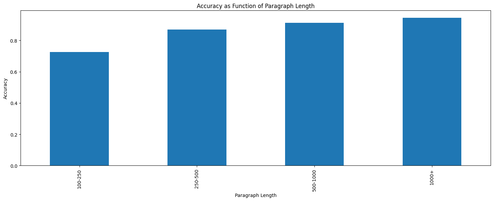
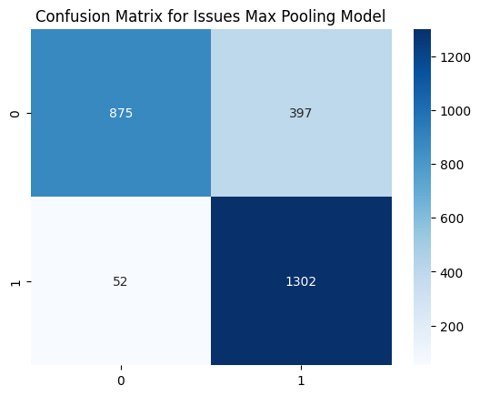
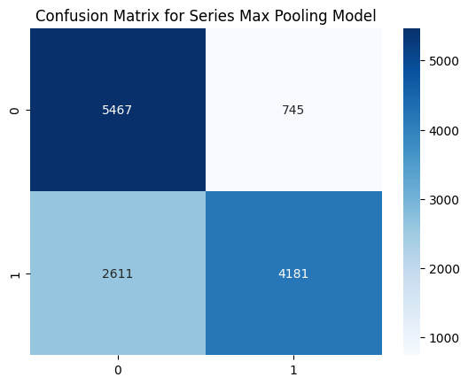

# Detecting Partisanship in Historical Newspaper Text

**Large scale Machine Learning Experimentation with 19th Century Newspapers**

## Overview

This project develops robust Machine Learning classifiers to infer political partisanship from digitized 19th century newspaper text using the [Chronicling America](https://chroniclingamerica.loc.gov) archive. Here, approximately 6.1 million paragraphs from California newspapers published in 1869-1870 are analyzed. 

The pipeline supports multiple granularities of analysis (paragraph, issue, series, and document level) and implements advanced aggregation techniques including max pooling and majority voting to improve classification accuracy.

## Key Results

| Experiment | Accuracy | Notes |
| ---------- | -------- | ----- |
| Paragraph level | 0.76 | Baseline classifier |
| Issue level | 0.83 | Max pooling aggregation |
| Document level | 0.91 | Issue-level train/test split |
| Series level | 0.71 | Stricter generalization test |

## Project Structure

```

partisan-classification/
├── main.py                    # Main entry point for paragraph-level pipeline
├── doc_level.py               # Document-level classification pipeline
├── utils/
│   ├── __init__.py
│   ├── consts.py              # Configuration constants and file paths
│   ├── data_splitting.py      # Train/test split utilities
│   ├── dataprep.py            # Data preparation and preprocessing
│   ├── helpers.py             # Text processing and visualization helpers
│   ├── logger_config.py       # Centralized logging configuration
│   ├── model.py               # Model training and evaluation functions
│   ├── path_utils.py          # Path configuration utilities
│   └── spark_session.py       # Singleton Spark session management
├── data/                      # Generated data files (gitignored)
├── models/                    # Trained model files (gitignored)
├── doc_level/                 # Document-level experiment outputs
├── .env                       # Environment variables (see .env.example)
└── requirements.txt

```

## Installation

**Prerequisites**

* Python 3.8+
* Apache Spark 3.x
* Java 8 (required for Spark)

### Setup

1. Clone the repository

```
git clone https://github.com/yourusername/partisan-classification.git

cd partisan-classification
```

2. Create virtual environment

```
python -m venv venv

source venv/bin/activate
```

3. Install dependencies

`pip install -r requirements.txt`

4. Configure environment variables

```
cp .env.example .env

# Edit .env with your paths
```

Required environment variables:

```
PARQUET_FILE=/path/to/chronicling_america.parquet
METADATA_CSV=/path/to/metadata.csv
MASTER_DIR=/path/to/output/directory
MODEL_STORAGE=/path/to/model/storage
DOC_LEVEL_DIR=doc_level
```

## Data pipeline

1. **Data Source**

The corpus is constructed from the **Chronicling America** digitized newspaper archive. Each paragraph is accompanied by rich metadata:

| Field | Description |
| ----- | ----------- |
| `series` | Newspaper series identifier (e.g. `/lccn/sn82014899`) |
| `issue` | Specific issue URL |
| `date` | Publication date |
| `id` | Unique document identifier |
| `text` | Raw paragraph text |

2. **Metadata-Driven Labeling**

Partisanship labels are assigned at series level using automated Regular Expression rules:

| Label | Partisanship | Regex Pattern |
| ----- | ------------ | ------------- |
| 0 | Democrat | `\bdemocratic\b` |
| 1 | Republican | `\brepublican\b` |
| 2 | Independent | `\bindependent\b` |
| 3 | No Mention | (default) |

3. **Data Statistics**

**Raw Metadata (1869 directory):**

| Label | Count |
| ----- | ----- |
| Democrat (0) | 1409 |
| Republican (1) | 1677 |
| Independent (2) | 215 |
| Not Mentioned (3) | 2256 |

**Paragraph-level Data:**

| Split | Democrat | Republican |
| ----- | -------- | ---------- |
| Train | 192716 | 303404 |
| Test | 47738 | 74421 |

Important points:
* Paragraph-level data statistics are obtained after filtering
* For binary classification experiments, only labels 0 and 1 are retained

4. **Preprocessing**

a. Split the text corpus into paragraphs using `\n\n+` delimiter

b. Tokenize and lowercase text

c. Remove punctuations and English stopwords

d. Filter paragraphs with fewer than 100 words to reduce noise

## Model Architecture

**Feature Engineering**

Text is represented using a HashingVectorizer for BOW. Configurations are as follows:

```
HashingVectorizer(
    n_features=10000, stop_words='english', 
    alternate_sign=False, norm='l2'
)
```

**Classifier**

Due to memory constraints, SGDClassifier with logistic regression loss function was implemented:

```
SGDClassifier(
    loss='log_loss', penalty='l2', 
    alpha=1e-4, random_state=0
)
```

**Training Strategy**

Due to memory constraints with 6M+ paragraphs, training follows an incremental learning process:

```
for chunk in pd.read_csv(train_file, chunksize=10000):
    X = vectorizer.transform(chunk['processed_text'])
    clf.partial_fit(X, chunk['label'], classes=[0, 1])
```

## Experiments

### Experiment 1: Paragraph level classification

**Objective**: establish baseline performance on individual paragraphs

**Train-Test Split**: random 80-20 split at paragraph level

**Results**:

| Label | Precision | Recall | F1-score |
| ----- | --------- | ------ | -------- |
| Democrat | 0.78 | 0.56 | 0.65 |
| Republican | 0.76 | 0.90 | 0.82 |

**Overall Accuracy**: 0.76

### Experiment 2: Issue level aggreagtion

**Objective**: aggregate paragraph predictions to issue-level using advanced techniques

**Max Pooling**: selects the paragraph with the highest absolute logit value to reresent each issue. The overall accuracy improved to 0.83

**Majority Voting**: uses top-k paragraphs ranked by absoute logit scores:

| k | Accuracy |
| - | -------- |
| 1 | 0.829 |
| 3 | 0.826 |
| 5 | 0.822 |

### Experiment 3: Whole-Issue classification

**Objective**: Train on entire issues as single documents

**Method**: concatenate all paragraphs within an issue into one document and split at the issue level

**Results**:

| Label | Precision | Recall | F1-score |
| ----- | --------- | ------ | -------- |
| Democrat | 0.95 | 0.86 | 0.90 |
| Republican | 0.88 | 0.95 | 0.92 |

**Overall Accuracy**: 0.91

### Experiment 4: Series-level split

**Objective**: Train generalization by ensuring no series appears in both train and test sets

A stricter evaluation process, that prevents the model from exploiting series-specific stylistic cues

**Results**:

| Label | Precision | Recall | F1-score |
| ----- | --------- | ------ | -------- |
| Democrat | 0.55 | 0.80 | 0.65 |
| Republican | 0.86 | 0.66 | 0.75 |

**Overall Accuracy**: 0.71

The 20-point accuracy drop indicates partial reliance on series-specific patterns.

### Experiment 5: Decorrelating Series and Partisanship

**Objective**: Remove series-specific artifcats to improve generalization

**Method**:

1. Train a series-specific classifier using K-fold cross-validation
2. Identify high-confidence series prediction
3. Exclude these examples from partisanship training
4. Retrain the classifier on reduced dataset

**Result**: Accuracy improved from 0.71 to **0.91** on series-level split after decorrelation

## Usage

Running the entire pipeline is not recommended for visualization and understanding of each experiment. Instead, run individual components from terminal as mentioned below.

```
from utils.spark_session import get_spark_session, stop_spark_session
from utils.dataprep import create_data, process_metadata
from utils.model import train_baseline, eval_performance

# Initialize Spark
spark = get_spark_session()

# Load and prepare data
df = create_data(spark, parquet_path)
metadata = process_metadata(spark, metadata_path)

# Train model
chunks = pd.read_csv(train_file, chunksize=10000)
train_baseline(chunks, model_path, stopwords=STOPWORDS)

# Evaluate
test_chunks = pd.read_csv(test_file, chunksize=10000)
eval_performance(model_path, test_chunks, stopwords=STOPWORDS)

# Cleanup
stop_spark_session()
```

## Results and Visualizations

### Probability Distribution Histograms

The model produces well-seperated probability distributions for Democrat and Republican labels, particularly for longer paragraphs and whole-issue classifications





Key observations:

* Democrat-label issues cluster near high P(democrat) values
* Republican-label issues cluster near high P(republican) values
* Overlapping regions indicate ambiguous or noisy content

### Diagnostic Analysis

1. Accuracy vs Paragraph length

Performance improves with paragraph length, confirming that longer text provides richer lexical signals

| Paragraph length | Accuracy |
| ---------------- | -------- |
| 100-250 words | 0.70 |
| 250-500 words | 0.80 |
| 500-1000 words | 0.85 |
| 1000+ words | 0.88 |



2. Temporal Stability

The **Pearson correlation** between accuracy and day-of-year is **0.016** and **p value 0.406**, indicating no significant seasonal bias, indicating stable performance across temporal range

### Confusion Matrices

Confusion Matrices are plotted to observe series-specific confounding, and is evident in the transposed pattern between the matrices

**Issue-Level Split**



**Series-Level Split**



## References

1. Hirano, S., & Snyder Jr, J. M. (2024). Measuring the Partisan Behavior of US Newspapers, 1880 to 1980. The Journal of Economic History, 84(2), 554-592.

2. Lee, B. C. G., et al. (2020). The Newspaper Navigator Dataset: Extracting Headlines and Visual Content from 16 Million Historic Newspaper Pages. ACM CIKM.

3. Dou, S., et al. (2022). Decorrelate Irrelevant, Purify Relevant: Overcome Textual Spurious Correlations from a Feature Perspective. COLING.

4. Torget, A. J. (2022). Mapping Texts: Examining the Effects of OCR Noise on Historical Newspaper Collections. Digitised Newspapers–A New Eldorado for Historians.